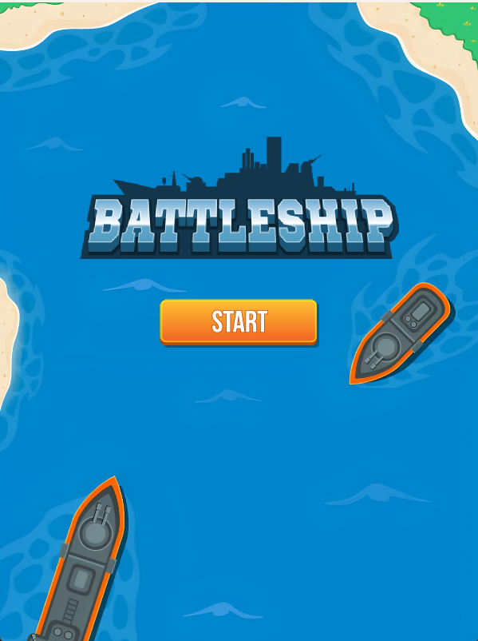

Battleship Game

This is a Battleship game implemented in Java with JavaFX. The game allows players to place their ships on a grid and take turns shooting at each other's ships until one player wins.

-------------
Start Screen
------

Placing the ships
---------

Winning Screen
---------

Losing Screen
---------

How to Run
---------
To run the game, follow these steps:

1. Make sure you have Java and JavaFX installed on your system.
2. Clone this repository or download the source code.
3. Open the project in your favorite Java IDE.
4. Build and run the Main class.

Class Descriptions
------------------
The game consists of the following classes:

- `Main`: The main class that extends Application and sets up the game window.
- `SoundHandling`: A utility class for handling sound effects in the game.
- `Sidebar`: A JavaFX class representing the sidebar in the game UI that displays the score.
- `Ship`: A class representing a ship in the game. It keeps track of its type, health, and position.
- `MainScene`: A JavaFX class representing the main scene of the game UI. It handles the start button click event and transitions to the game screen.
- `HoveringShip`: A JavaFX class representing a ship that hovers over the grid during ship placement.
- `Game`: The main game class that manages the game logic, including player and enemy moves, ship placement, and game state.
- `Cell`: A class representing a cell in the game grid. It keeps track of whether it has been shot, contains a ship, and the associated board.

How to Play
------------
1. Upon starting the game, you will see the main menu screen.
2. Click the "Start" button to begin the game.
3. To place your ships, hover the ship over the grid and scroll to rotate it. Left-click on the grid to place the ship.
4. After placing all your ships, the game will start, and you can take turns shooting at the enemy's ships by clicking on the cells in their grid.
5. The game will continue until either you or the enemy has no more ships remaining.
6. The player with no remaining ships loses the game.

Enjoy playing Battleship!

